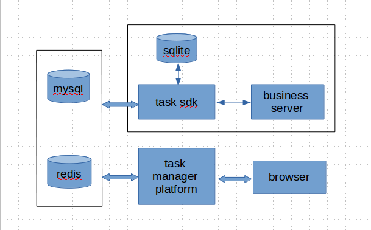

# 任务调度系统

## 第一章 系统概述
- 订单系统在电商，银行，证券交易等诸多领域广泛采用，通常采用异步处理模式
- 任务调度系统的设计目的是方便服务端异步接口的开发，先将合法请求入库，启动异步处理任务，同时返回“请求已接受”应答结果，处理任务完成业务之后更新业务处理状态，通知调用者处理结果，调用者轮循查询业务处理结果直到业务处理完成
- 高稳定，任务不丢失，不重复执行，无并发问题
- 高可用
- 高性能，尽量少与db交互，尽量少交互信息量，批量查询

## 第二章 工作原理
- 基于生产者－消费者模式
- 利用redis的hash,zset数据类型创建工作队列
- 数据存储redis、mysql，sqlite

### 系统框图

## 第三章 数据结构

- task: {childTask1,childTask2,...}
- taskHandler: {childTaskHandler1,childTaskHandler2,...}

### mysql表设计

### redis数据结构

#### 任务信息
hash类型，zset类型，采用方案一

方案一

	t_task:$task_key
        task_key
        handler
        param
        status
        retry_strategy
        retry_interval
        next_time
        last_time
        first_time

方案二

    t_task
        $task_key {"handler":"","param":"","status":"","retryStrategy":"","retryInterval":"","nextTime":"","lastTime":"","firstTime":""}

等待处理队列: t_task:waiting
处理中队列: t_task:doing
成功队列: t_task:successful
失败队列: t_task:failed

#### 子任务信息
hash类型，采用方案二，检查子任务状态

方案一
    t_child_task:$task_key:$child_handler
        handler
        status
        last_time
        first_time

方案二

    t_child_task:$task_key
        $child_handler:handler
        $child_handler:status
        $child_handler:last_time
        $child_handler:first_time

方案三

    t_child_task:$task_key
        $child_handler {"handler":"","status":"","lastTime":"","firstTime":""}

#### 任务变更
hash类型

    t_task_change:$task_key
        $change_type:changeType 1
        $change_type:status 0
        $change_type:errorCode 0
        $change_type:errorDesc ''

### 处理队列

- 日集合,
- 执行队列,zset,running:{(id1 time),(id2 time),...}
- 等待队列,zset,waiting:{(id1 time),(id2 time),...}
- 挂起队列,zset,pause:{(id1 time),(id2 time),...}
- 成功集合,zset,sucess:{(id1 time),(id2 time),...}
- 失败集合,zset,fail:{(id1 time),(id2 time),...}
- 挂起取消集合,zset,failList:{(id1 time),(id2 time),...}

### 任务并发策略:

- 同一个任务,只能由一个线程执行,不可以同时被多个线程执行
- id唯一,已经存在的,不可以再插入
- params唯一,已经存在的,不可以再插入

### 任务重启策略:

- 成功的不可以重启
- (#失败的不可以重启)
- 处理中的不可以重启
- 丢失的可以重启

### 任务重试策略:

- 等时重试n次;
- 指数间隔重试n次;
- 前3次等时后指数间隔一共重试n次;
- 无限重试;
- 首日重试n次，次日重试n次;

### 任务状态:

- success
- fail
- failretry
- pause
- pausequit

## 第四章　功能列表
### sdk功能列表
- 生产任务
- 消费任务
- 暂停（挂起）任务
- 恢复任务
- 移除任务
- 取消任务

### 管理平台功能列表
- 添加（补充）丢失任务
- 暂停（挂起）任务
- 重启任务
- 取消任务
- 查看任务列表
- 查看任务详情
- 修改任务执行状态
- 修改子任务执行状态

## 第五章 任务生产

## 第六章 任务消费

## 第七章 任务清理

- T日清理T-3日之前的任务
- 状态为成功，失败，挂起取消的任务，是最终状态，从redis删除: t_task, t_child_task
- 在任务管理系统实现

## 第八章 任务管理系统

- 查看历史任务信息
- 查看正在执行任务信息
- 增加、批量增加任务

# 基于redis的任务调度系统-简单版

###数据结构
未决列表
任务信息表
任务执行信息表

###任务未决列表zset
t_task:pending 

###任务信息表hash
t_task:info:${key}

###任务执行列表zset
t_task:executing

###任务生成
1.入pending，nextTime+30分
2.入info
3.入executing，当前时间

情况1:入pending失败
mysql对账，补充任务

情况2:入info失败
pending任务处理，找不到info丢掉
mysql对账，补充任务

情况3:入executing失败
pending任务处理，入executing/当前时间，入pending/nextTime+30分

###任务消费
1.取executing
2.取info

查不到info，丢掉 
成功，修改info，入pending，当前时间
失败，修改info，入pending，当前时间
重试，修改info，入executing/当前时间+重试间隔，入pending/nextTime+30分

####重试
情况1:入executing失败，pending任务处理，入executing重试
情况2:入pending失败，pending任务处理，入executing重试

###pending任务处理
1.取pending
2.取info

查不到info，丢掉

成功，入mysql，删除info，删除pending
失败，入mysql，删除info，删除pending
####
情况1:入mysql失败，等待重试
情况2:删除info失败，等待重试
情况3:删除pending失败，等待重试

超时，入pending/nextTime+30分，入executing/nextTime

